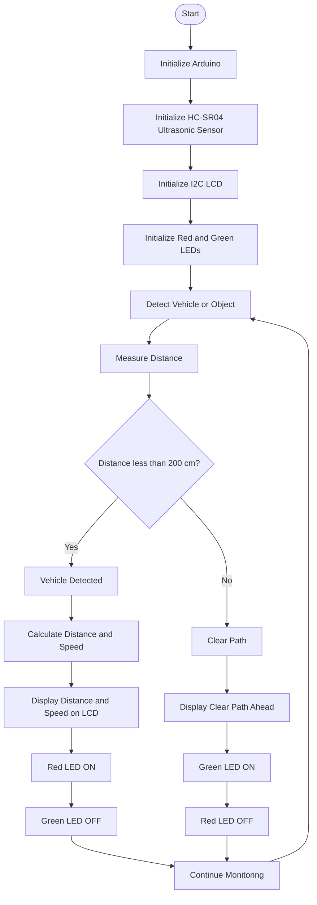

# Prevention of Accidents Due to Blind Spots

## 📌 Project Overview

**Prevention of Accidents Due to Blind Spots** is an Arduino-based road safety system designed to reduce the risk of accidents on curved, narrow, and mountainous roads where drivers have limited visibility of approaching vehicles.

The system uses an **Arduino Uno, HC-SR04 ultrasonic distance sensor, I2C LCD display, and red/green LED indicators**. The ultrasonic sensor detects an approaching object, while the LCD displays distance and estimated speed information. The LED indicators provide a quick visual warning to the driver.

The project was tested using **Tinkercad simulation** and demonstrated using a physical prototype.

---

## 🎯 Problem Statement

Mountain roads, narrow roads, sharp curves, and U-junctions can create blind spots where drivers cannot see vehicles or obstacles approaching from the other side.

Limited visibility combined with vehicle speed can reduce the driver's reaction time and increase the possibility of collisions or vehicles leaving the road.

This project proposes a smart road safety system that detects approaching vehicles and provides real-time visual and display-based warnings to drivers.

---

## 💡 Proposed Solution

The proposed system uses an ultrasonic sensor to detect an approaching vehicle/object.

### Working

1. The HC-SR04 ultrasonic sensor sends an ultrasonic pulse.
2. The reflected signal is received by the sensor.
3. Arduino calculates the distance of the detected object.
4. Two distance measurements are used to estimate the object's speed.
5. The LCD displays distance and speed information when an object is detected.
6. A **red LED** indicates that an object is within the configured detection threshold.
7. A **green LED** indicates a clear path.

---

## 🛠️ Hardware Components

- Arduino Uno
- HC-SR04 Ultrasonic Distance Sensor
- 16×2 I2C LCD Display
- Red LED
- Green LED
- Resistors
- Breadboard
- Connecting wires

---

## 💻 Software and Tools

- Arduino IDE
- Tinkercad Circuits
- C/C++ (Arduino programming)

### Arduino Libraries

```cpp
#include <Wire.h>
#include <LiquidCrystal_I2C.h>
```

---

## 🔌 Pin Connections

The following connections correspond to the Arduino code included in this repository:

| Component | Arduino Pin |
|---|---|
| HC-SR04 TRIG | D8 |
| HC-SR04 ECHO | D9 |
| Red LED | D2 |
| Green LED | D3 |
| I2C LCD SDA | A4 |
| I2C LCD SCL | A5 |
| LCD VCC | 5V |
| LCD GND | GND |
| HC-SR04 VCC | 5V |
| HC-SR04 GND | GND |

---

## ⚙️ Working Principle

The HC-SR04 measures the distance between the sensor and an object using ultrasonic waves.

The distance is calculated using:

```text
Distance = (Time × 0.034) / 2
```

The division by 2 accounts for the ultrasonic signal travelling to the object and returning to the sensor.

The project takes two distance measurements and estimates speed from the change in distance over the elapsed time.

---

## 🚦 LED Indication

The current Arduino program uses a **35 cm threshold**.

| Condition | Red LED | Green LED | LCD |
|---|---|---|---|
| Distance < 200 cm | ON | OFF | Distance + Speed |
| Distance ≥ 200 cm | OFF | ON | Clear Path Ahead |

> **Note:** The threshold is configured in the Arduino code and can be changed according to the simulation or prototype requirements.

---

## 🖥️ Tinkercad Simulation

The project was simulated using **Tinkercad Circuits**. The simulation includes the Arduino, ultrasonic sensor, LCD display, and LED indicators.

### Tinkercad Link

 Tinkercad link here:

```text
https://www.tinkercad.com/things/9GuOVfRx1Rw-project/editel
```
---
## 🔄 Overall Workflow


## 📊 Testing and Results

The project was tested under different vehicle-detection scenarios.

### Scenario 1 — Vehicle Detected

When an object/vehicle is detected within the configured threshold:

- Red LED turns ON.
- Green LED turns OFF.
- LCD displays distance.
- LCD displays estimated speed.

### Scenario 2 — No Vehicle Detected

When the detected distance is outside the configured threshold:

- Red LED turns OFF.
- Green LED turns ON.
- LCD displays distance.
- LCD displays estimated speed.

The project report also describes testing under both-side detection, single-side detection, and no-detection scenarios.
---
## 📁 Repository Structure

```text
Project-Details/
│
├── Arduino_code
│   └── Arduino source code for ultrasonic sensor and LCD speed display
│
├── PROTOTYPE_DEMO.mp4
│   └── Demonstration video of the physical project prototype
│
├── Presention
│   └── Project presentation
│
└── README.md
    └── Project documentation and details
```

---

## 🚀 Future Scope

The project report identifies several possible improvements:

- Integration of AI/ML for vehicle detection.
- Use of longer-range ultrasonic sensors.
- High-visibility warning LEDs.
- Weather-resistant LCD displays.
- Improved hardware suitable for real-world road environments.
- Improved detection and alert mechanisms for curved mountain roads.
---
## 👨‍💻 Project Team

**Manchana Vignesh**
**P. Ambarish**  
**KVS. Karthik**  

**Department of Electronics and Communication Engineering**  
**Vasavi College of Engineering, Hyderabad**

--


## 📚 References

The project report contains references to an ITM Conference publication and an IEEE Xplore publication related to road safety.

---

## ⭐ Project Highlights

- 🚗 Blind-spot vehicle detection
- 📡 Ultrasonic distance measurement
- 📺 Real-time LCD information
- 🔴 Red LED warning
- 🟢 Green LED clear-path indication
- 🧪 Tinkercad simulation
- 🔧 Arduino-based prototype
